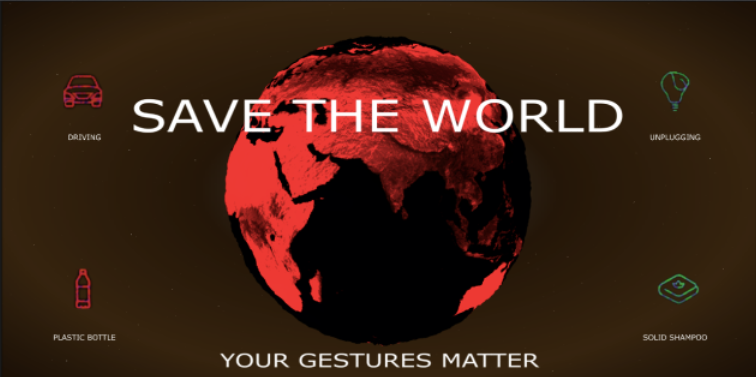

# SaveTheWorld

SaveTheWorld is creative programming project, with the aim of raising the awareness of the impact of our gestures on the environment.
This installation is implemented with python (back-end), TouchDesigner (front-end) e Supercollider for the music landscape.
The top feature is the extremely user-reactive interface.

  

You can find more here: 
This version is avaiable only for desktop device.

***

# Abstract

Today, we hear about climate change almost everyday: on the news, tv shows and social
media. It’s a topic that is urgent to address, in order to preserve the planet we’re living in and
be sure to make it habitable for further generations. 
The situation is critical and we all have to make an effort changing our lifestyle in order to reach a sustainable result. 
The goal of this project is to make people aware of how simple daily actions can heavily impact the 
environment. With this concept in our mind, we thought that an interactive installation could send a clear message to the user, i.e.
that everybody can contribute to change things for the better, and so to "Save the World". 
We gathered data from the web to understand how much our daily habits can threat or can help our planet 
in terms of CO2 emissions, that we used as a impact quantifier. 
Save the World's interface consists in icons showing the daily actions we chose and a 3D globe representing
our planet. The user will look at the icon and try to mimic the action displayed in it with hand gestures. 
These will be captured and recognized, then, with a strong real time visual feedback, the future impact of what
the user did will be shown on the globe, that will change accordingly. 
The effects on the Earth that the user will see must be thought in large-scale terms, like all population
of the world does that action at that moment. 
The degradation or the improvement of the health of our planet will make the user associate the actions
he mimiced and their impact. In this way a sensibilization takes place and our hope is that also 
in real life he will remember what effect his lifestyle can have and act as a consequence. 
To have a visual representation of the world Touchdesigner has been used, exploiting its compatibility 
through OSC messages with Python, the latter responsible for taking and classifying the gestures. 
In the end, Supercollider will generate soundscapes according to the health conditions.

# Useful Links on Environment

- App to measure your environment impact: https://aworld.org/
- Generative Human Models: https://github.com/google-research/google-research/tree/master/ghum
- Multiperson: https://www.section.io/engineering-education/multi-person-pose-estimator-with-python/

# References

MediaPipe:
- GitHub: https://google.github.io/mediapipe/solutions/pose; 
- Classification article: https://ai.googleblog.com/2020/08/on-device-real-time-body-pose-tracking.html

TouchDesigner: 
- Official documentation: https://docs.derivative.ca/Main_Page
- Introductive course (ITA): https://www.youtube.com/playlist?list=PLhhSecfe3762IytiKsT472xhnF1LciVJE
- Useful channel: https://www.youtube.com/channel/UCONptu0J1PCrW9YfBtSdqjA
- Introductive site with example: https://alltd.org/category/beginner/
***
